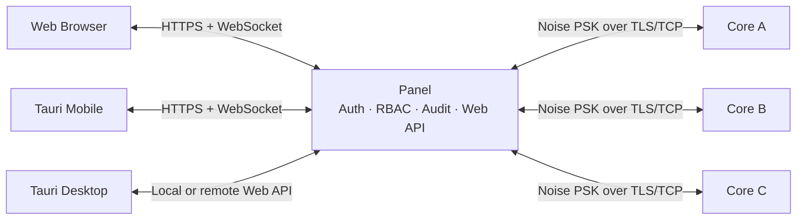
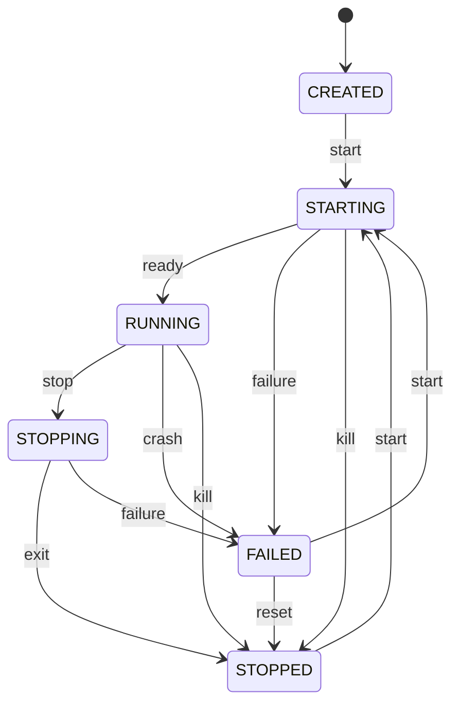
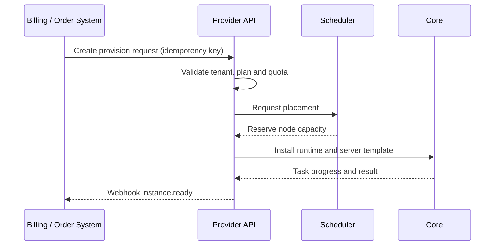

# Minecraft Nexus Panel（MCNP）开发计划

## 1. 产品目标

Minecraft Nexus Panel（项目简称 MCNP）是一个面向 Minecraft 服主和运维人员的多节点服务器管理工具。它需要在同一套领域模型和
API 上支持以下运行形态：

| 模式      | 启动单元                        | 主要职责                                                | 可连接其他 Core | 对外提供 WebUI     |
|-----------|---------------------------------|---------------------------------------------------------|-----------------|--------------------|
| `core`    | Core 服务                       | 管理本机 Minecraft 实例，提供加密 TCP 接口              | 不适用          | 否                 |
| `panel`   | Panel 服务                      | 登录鉴权、用户与权限、连接多个 Core、提供 Web API/WebUI | 是              | 是                 |
| `all`     | Core + Panel                    | 单进程/一键运行，同时保留完整 Core TCP 接口             | 是              | 是                 |
| `desktop` | Tauri + 本地 Core/Panel sidecar | 本地 GUI、管理本机实例、连接其他 Core                   | 是              | 是，可配置监听地址 |
| `mobile`  | Tauri Mobile 客户端             | 通过 Panel Web API 管理服务器，不直连 Core              | 通过 Panel      | 否                 |

首个稳定版本先跑通“创建实例、准备运行环境、安装服务端、启动、查看终端、发送命令、停止实例”的完整链路；随后扩展配置识别、模组/插件、Docker、计划任务和商业服务商能力，并保证部署、鉴权和协议能够继续演进。

## 2. 系统边界



- Core 只信任持有节点连接密钥的 Panel，不处理终端用户身份。
- Panel 是用户、权限、审计、Core 注册信息和公开 Web API 的唯一权威来源。
- Mobile 永远只连接 Panel，避免把 Core 密钥或节点拓扑暴露到移动设备。
- Desktop 运行本地 Panel/Core，并用与浏览器相同的 WebUI；Tauri 仅提供系统集成和生命周期管理，不复制业务 API。
- `all` 与 `desktop` 不使用私有捷径绕过协议，Panel 仍通过 loopback TCP 连接内置 Core，以降低分离模式与合并模式的行为差异。

## 3. 建议目录结构

```text
MinecraftNexusPanel/
├── apps/
│   ├── nexus/                 # core/panel/all 命令行入口
│   ├── desktop/               # Tauri Desktop 壳与 sidecar 生命周期
│   └── mobile/                # Tauri Mobile 壳
├── crates/
│   ├── nexus-domain/          # 实例、节点、任务、权限等纯领域类型
│   ├── nexus-protocol/        # Core TCP 帧、握手、请求/响应与版本协商
│   ├── nexus-core/            # 进程、文件、日志、指标与实例生命周期
│   ├── nexus-panel/           # HTTP/WS、鉴权、RBAC、审计、Core 连接池
│   ├── nexus-storage/         # SQLite/PostgreSQL 仓储实现与迁移
│   └── nexus-config/          # 配置加载、环境变量和校验
├── frontend/
│   ├── app/                   # 统一 Vue 3 + TypeScript 应用
│   ├── api-client/            # 由 OpenAPI 生成的共享客户端
│   ├── ui/                    # Web/Desktop/Mobile 共享组件和设计令牌
│   └── platform/              # Browser/Tauri 能力适配器
├── docs/
│   ├── api/                   # API 与协议设计
│   ├── architecture/          # ADR 和部署说明
│   └── operations/            # 安装、备份、升级和故障排查
├── examples/                  # 示例配置和反向代理配置
└── tests/                     # 跨进程端到端测试
```

## 4. 关键技术决策

### 4.1 Core 连接协议

- 传输层为 TLS/TCP，应用层使用长度前缀帧；Core 支持自定义证书，未配置时持久化生成自签名身份。
- TLS 验证 Core 身份并派生传输密钥；TLS 流内继续使用 PSK 完成 Noise 握手，PSK 本身不在网络中传输。
- v1 载荷使用 UTF-8 JSON，优先可调试性；大文件使用分块传输，避免单帧无限膨胀。
- 每个请求必须携带 `requestId`，响应原样返回；事件使用独立 `eventId` 和单调递增序号。
- Panel 维护连接池、心跳和指数退避重连；Core 不主动连接 Panel。
- 协议细节见 [`docs/api/core-tcp.md`](docs/api/core-tcp.md)。

### 4.2 Web API 与客户端

- REST 基础路径固定为 `/api/v1`；只在破坏兼容性时增加主版本。
- Panel WebUI、Desktop 和 Mobile 统一使用 Vue 3、TypeScript、Vite、Vue Router、Pinia 与 TanStack Vue Query。
- 三端复用同一套页面、领域 store、API Client、表单校验和实时事件 SDK；平台差异只能通过 `platform` 适配器访问。
- Panel 托管 Vue 构建产物；Tauri Desktop/Mobile 加载同一应用构建，不复制业务页面。
- 浏览器适配器使用 Cookie/CSRF；Tauri 适配器使用系统安全存储中的 Access/Refresh Token。
- 浏览器使用 `HttpOnly + Secure + SameSite` 会话 Cookie，并通过 CSRF Token 保护写操作。
- Desktop/Mobile 使用短期 Access Token 与可轮换 Refresh Token，Token 必须绑定设备会话。
- 实时日志、指标、节点状态和任务进度统一通过 WebSocket 推送。
- 耗时或不可立即完成的操作返回 `202 Accepted` 和 `taskId`。
- 当前文件管理首阶段通过 `files` capability 暴露 Core 沙箱列表、32 KiB 分块读取、1 MiB 内原子写入、目录创建、移动、批量操作、删除任务和异步 ZIP 归档准备；`transfer-v1` 通过固定 1 MiB 分片提供会话化上传和下载。Panel REST 使用二进制响应、`ETag`/`If-Match`、`Content-SHA256`、传输游标和幂等键传递同一约束。`config` capability 目前提供 `PROPERTIES` 配置识别、Schema/UI Schema、SHA-256 revision、保留布局的顶层补丁和 raw 读写。
- API 细节见 [`docs/api/web-api.md`](docs/api/web-api.md) 和 [`docs/api/websocket.md`](docs/api/websocket.md)。

### 4.3 数据与密钥

- 默认数据库为 SQLite，规模化部署允许切换 PostgreSQL。
- 用户密码使用 Argon2id 保存，不记录明文或可逆密码。
- Core PSK 必须使用 Panel 主密钥进行信封加密后落库；主密钥只来自环境变量、系统密钥环或外部 Secret Store。
- Refresh Token 只保存摘要；重用已轮换 Token 时撤销整个 Token Family。
- 审计日志记录操作者、目标、结果、请求 ID 和来源 IP，但对密码、Token、PSK、控制台敏感参数进行脱敏。

### 4.4 权限模型

采用 RBAC，并按 Core/实例资源清单限定作用范围。没有显式授予即拒绝，不引入容易产生冲突的 deny 规则：

| 权限                                                    | 含义                               |
|---------------------------------------------------------|------------------------------------|
| `core.read` / `core.manage`                             | 查看或管理 Core 节点               |
| `environment.read` / `environment.manage`               | 查看或安装 Java、Node.js、Python   |
| `instance.read` / `instance.create` / `instance.delete` | 查看、创建或删除实例               |
| `instance.settings.basic`                               | 修改名称、类型、到期时间等基本设置 |
| `instance.settings.launch`                              | 修改启动命令、更新命令和进程包装   |
| `instance.settings.path`                                | 修改工作目录                       |
| `instance.settings.container`                           | 修改镜像、挂载、端口和资源限制     |
| `instance.settings.cpu`                                 | 修改 CPU 亲和、大核偏好和预留策略  |
| `instance.control`                                      | 启停、重启、更新或强制终止实例     |
| `instance.console.read` / `instance.console.write`      | 查看终端或发送命令                 |
| `file.read` / `file.write`                              | 浏览或修改实例文件                 |
| `config.read` / `config.write`                          | 查看或修改识别后的结构化配置       |
| `extension.read` / `extension.manage`                   | 查看或安装、更新、删除模组/插件    |
| `image.read` / `image.manage` / `image.build`           | 查看、拉取/删除或构建镜像          |
| `schedule.read` / `schedule.manage`                     | 查看或管理计划任务                 |
| `user.read` / `user.manage`                             | 查看或管理用户、用户组和授权范围   |
| `audit.read`                                            | 查看审计记录                       |

用户组授权包含 `permissions` 与 `instanceScopes`；`instanceScopes` 可列出 Core、实例或标签选择器。所有列表和单资源访问都必须在服务端过滤，不能只依赖前端隐藏按钮。

### 4.5 功能执行模型

- **环境管理**：Core 将 Java、Node.js、Python 安装到受管工具链目录，不默认修改系统 PATH；来源清单记录版本、平台、架构、下载地址和
  SHA-256。
- **一键搭建**：由可版本化的安装模板描述服务端来源、所需环境、下载/解压步骤、默认配置和启动命令；当前目录已覆盖 Java 原版、模组端、插件端、混合端、代理端和基岩版端，模板执行是可审计异步任务。
- **进程包装**：实例分别配置 `runtimeMode=HOST|CONTAINER` 与 `supervisorMode=DIRECT|MCDR`，避免用一个布尔值混合容器和
  MCDR。
- **配置识别**：配置提供者输出 JSON Schema、UI Schema 和保留注释/顺序的 round-trip 补丁；无法识别时退回安全的原始文本编辑器。
- **模组/插件**：Panel 统一搜索不同内容源，Core 执行下载和原子替换；必须保留来源、项目 ID、版本、哈希和依赖关系。
- **Docker**：Core 通过 Docker Engine API 管理镜像和容器；禁用任意宿主机 socket 转发、特权容器和越界挂载，除非管理员显式放开策略。
- **任务调度**：定时任务使用带时区的 Cron，事件任务订阅实例生命周期、玩家数、退出码等领域事件；每次触发都有去重键和执行记录。
- **大核调度**：Core 启动时识别 CPU 拓扑、性能类别、NUMA 和可用逻辑 CPU；实例可选择自动优先性能核、手动 CPU 集合、独占/共享和
  NUMA 策略。

### 4.6 服务端类型、扩展布局与代理拓扑

`InstanceKind` 是服务端类型的稳定领域枚举，`InstallTemplate` 是版本化安装能力的边界。当前 M2 目录按下表建模：

| 分类 | 类型 | 运行时/扩展/拓扑 |
|------|------|------------------|
| Java 原版端 | Vanilla | Java；无默认扩展布局。 |
| Java 模组端 | NeoForge、Forge、Fabric | Java；模组独立管理，常见目录为 `mods/`。 |
| Java 插件端 | Bukkit、Spigot、Paper、Purpur、Pufferfish、Folia、Leaf | Java；插件独立管理，常见目录为 `plugins/`。 |
| Java 混合端 | Mohist、Magma、Sponge、Arclight、Youer、AsyncYouer、Silkard、CatServer、Lingshu | Java；插件和模组分别建模，目录由 `InstallTemplateExtensionLayout` 按端/版本声明。 |
| 一对多代理端 | Velocity、Waterfall、BungeeCord、Lightfall | Java；`ProxyTopology::OneToMany`，通过 `ProxySubserver` 管理多个后端。 |
| 一对一基岩代理端 | Geyser | Java；`ProxyTopology::OneToOne`，管理一个 Java 后端，同时提供 Bedrock/RakNet 画像。 |
| 基岩版服务端 | Bedrock Dedicated Server、PocketMine-MP、Nukkit、Cloudburst Nukkit | Native/PHP/Java 运行时按类型决定；默认 RakNet UDP 端口 `19132`，配置与扩展能力按端区分。 |

实现规则：

- 混合端的插件和模组必须使用独立的 `ExtensionKind`、安装记录和兼容性结果。目录不能由 Panel 全局硬编码；同一端可以有多个目录，同一目录也可能承载不同扩展种类（例如当前 Sponge 画像），因此扫描和安装必须以模板声明为准。
- Velocity、Waterfall、BungeeCord、Lightfall 是一对多代理，Geyser 是一对一代理。子服务器关系独立于实例基本设置，目标必须是同一 Core 上已存在的非代理实例；Core 强制拓扑数量上限。
- Bedrock Dedicated Server、PocketMine-MP、Nukkit、Cloudburst Nukkit 和 Geyser 使用 `BedrockManagementProfile` 描述 RakNet UDP、默认端口、配置文件和插件能力。基岩端的配置、扩展、健康检查、升级、备份恢复和端口冲突处理不能假设为 Java 服务端逻辑。
- 当前已完成类型枚举、内置目录、扩展布局、代理子服务器关系和基岩画像；Vanilla、Paper、Velocity、Fabric、Forge、Purpur、Folia、Waterfall、BungeeCord、Geyser 已接入官方版本元数据目录，但归档结构、启动命令和版本化运维配方仍需逐项验证，其余类型仍需补充 provider。

### 4.7 文件管理边界

- 文件路径始终相对于实例工作目录。Core 拒绝绝对路径、NUL、反斜杠、`.`/`..` 段和逃逸实例根目录的符号链接；Panel 不直接访问 Core 文件系统。
- 配置文档 ID 由规范化相对路径派生，Core 递归扫描 `.properties`、`.json`、`.yaml`/`.yml` 和 `.toml` 文件并限制单文件 1 MiB；结构化写入按内容 SHA-256 做 revision 校验，properties 提供者只接受字符串、布尔和数字标量并保留注释、顺序和换行，JSON/YAML/TOML provider 返回类型化 Schema/UI Schema 并要求 `allowLossy=true` 才能规范化写回。provider-specific Schema 与跨文件校验仍未交付。
- 已交付能力包括 `file.list` 分页、`file.read` 分块读取、`file.write` 小文件原子替换、`file.mkdir`、`file.move`、`file.delete`、`file.batch`、`file.archive.create` 和 `file.task.get`。读取上限为 32 KiB，整体写入上限为 1 MiB，写入可用完整文件 SHA-256 做乐观并发校验。
- 目录创建和同一实例内移动支持递归目录、覆盖选项和非空目录保护；删除要求显式 `DELETE` 确认，文件与目录删除通过 Core 后台任务执行，递归删除仍拒绝符号链接和实例根目录外路径。批量操作最多 64 项，按顺序执行并返回逐项状态，失败时保留部分结果且不伪造回滚。归档最多接收 128 个源路径，递归结果最多 16,384 个 ZIP 条目、未压缩源数据最多 4 GiB，包含文件、目录、空目录和实例根目录时按条目报告进度，并使用实例目录内临时文件原子落盘。大文件上传和下载通过 `transfer-v1` 使用固定 1 MiB 分片；上传按序写入临时文件并校验分片/完整摘要，下载按序读取并允许已读分片重试，二者均有 4 GiB 单文件上限、分别 16 会话配额、放弃和完成操作。传输状态暂存 Core 内存，重启不续传；跨重启续传、快照和差异比较仍需后续任务中心能力，不能把小文件 PUT 当作大文件上传协议。

## 5. 功能范围

| 功能域    | 首版能力                                                  | 后续扩展                              |
|-----------|-----------------------------------------------------------|---------------------------------------|
| 环境管理  | Java/Node.js/Python 版本发现、安装、校验、删除            | 镜像源、代理、共享缓存、离线包        |
| 一键搭建  | 29 类服务端/代理/基岩模板目录、版本计划解析与异步安装     | 各类型官方元数据、版本化安装配方、模板市场、自定义签名模板、整包导入 |
| 配置识别  | `server.properties` 无损标量补丁、JSON/YAML/TOML Schema/UI Schema 和 raw 编辑 | 插件贡献 Schema、跨文件校验、配置差异 |
| 模组/插件 | 搜索、安装、更新、删除、兼容性提示                        | 依赖求解、整合包、批量升级与回滚      |
| 终端      | 实时 stdout/stderr、stdin 命令、历史游标                  | 搜索、导出、命令片段、多人协作提示    |
| 文件管理  | 目录列表、分块读取、原子写入、目录创建、移动、批量操作、删除任务、ZIP 归档准备、会话化分块上传/下载、ETag/If-Match | 跨重启续传、快照与差异比较、统一任务中心进度 |
| 镜像管理  | 拉取、更新、删除、构建、构建日志                          | 私有仓库凭据、签名验证、垃圾回收策略  |
| 容器启动  | 镜像、端口、环境变量、挂载和资源限制                      | 网络策略、GPU、Compose 导入           |
| CPU 调度  | 识别大小核、优先性能核、手动绑定和容器 cpuset             | NUMA 感知、独占预留、商业套餐核配额   |
| 计划任务  | Cron 与实例事件触发、执行历史                             | 条件表达式、通知、可视化工作流        |
| 实例设置  | 名称、类型、到期时间、目录、启动/更新命令、运行与包装模式 | 配置模板继承、批量策略                |
| 用户管理  | 用户组、细粒度权限、实例清单                              | 临时授权、审批、企业身份源            |

终端仅表示实例进程的标准输入输出，不提供 Core 宿主机 Shell。宿主机远程 Shell 属于独立高风险产品能力，不纳入当前范围。

## 6. 领域对象

- **CoreNode**：一台运行 Core 的机器及其连接、能力和健康状态。
- **Instance**：一个 Minecraft 服务端实例，归属于且仅归属于一个 Core。
- **InstanceRuntime**：进程 PID、运行状态、启动时间、退出码、资源使用量。
- **ManagedRuntime**：Core 上受管的 Java、Node.js 或 Python 版本。
- **InstallTemplate / InstallSource**：服务端一键安装模板和可信下载来源。
- **InstanceKind / InstallTemplateFamily / InstallTemplateExtensionLayout**：服务端类型、模板家族和按扩展种类声明的目录布局。
- **ProxyTopology / ProxySubserver**：代理一对多/一对一拓扑和后端实例关系。
- **BedrockManagementProfile**：基岩传输、默认端口、配置文件和扩展能力画像。
- **ConfigDocument / ConfigSchema**：识别后的配置文件、Schema、revision 和原始格式信息。
- **ExtensionProject / ExtensionInstall**：模组或插件的来源项目及本地安装记录。
- **Image / ImageBuild**：Docker 镜像元数据和构建任务。
- **CpuTopology / CpuPolicy / CpuReservation**：Core CPU 拓扑、实例亲和策略和调度预留。
- **Schedule / Trigger / Execution**：计划、触发条件和每次执行记录。
- **Task**：创建、安装、备份、迁移等异步操作。
- **User / Group / Role / Permission / ResourceScope**：Panel 用户、用户组、权限与实例范围。
- **Session / Device**：浏览器或原生客户端登录会话。
- **AuditEvent**：不可变的安全与运维操作记录。

实例状态机：



状态变更必须由 Core 产生事件，Panel 不能仅凭 HTTP 请求成功推断最终状态。

## 7. 分阶段交付

### M0：设计冻结与工程骨架

- 建立 Rust workspace、Web workspace、统一格式化和 CI。
- 冻结 v1 Core 帧、错误模型和首批 OpenAPI。
- 建立配置结构、日志规范、请求 ID 和版本信息。
- 验收：所有空应用可构建，OpenAPI 可校验，协议编解码有往返测试。

### M1：最小可用纵向链路

- Core：PSK 握手、节点信息、实例列表、启动/停止/终止、命令、日志游标。
- Panel：管理员初始化、登录、Core 增删与连通性测试、实例代理 API。
- WebUI：登录、Core 切换、实例列表、实例控制台和基础状态。
- `all`：单命令启动，仍暴露 Core TCP 端口。
- 验收：从空数据创建一个实例，启动测试进程，实时查看输出并安全停止。

### M2：环境与一键搭建

- Java/Node.js/Python 受管安装、版本选择、校验与清理。
- 服务端目录、安装模板、下载缓存和校验；支持 Direct/MCDR 包装。模板目录覆盖 Vanilla、NeoForge、Forge、Fabric、Bukkit、Spigot、Paper、Purpur、Pufferfish、Folia、Leaf、Mohist、Magma、Sponge、Arclight、Youer、AsyncYouer、Silkard、CatServer、Lingshu、Velocity、Waterfall、BungeeCord、Lightfall、Geyser、Bedrock Dedicated Server、PocketMine-MP、Nukkit 和 Cloudburst Nukkit。
- 混合端分别管理插件与模组，按模板/版本解析不同扩展目录；代理端按一对多或一对一拓扑管理子服务器；基岩端按 RakNet、端口、配置和扩展能力提供专门运维画像。
- 实例完整设置：名称、类型、到期时间、工作目录、启动/更新命令。
- 验收：在空 Core 上选择已验证模板与运行时，一次操作完成下载、配置和首次启动；代理拓扑和基岩端专门约束不能被普通 Java 实例路径绕过。

### M3：日常运维能力

- 配置识别和结构化表单、文件管理、分块上传/下载、实例终端；当前已完成 `server.properties` 无损 provider、JSON/YAML/TOML provider、文件沙箱列表、分块读取、小文件原子写入、目录创建、移动、批量操作、删除任务、ZIP 归档准备和活动 Core 内会话化分块上传/下载，后续补齐 provider-specific Schema、跨重启续传、快照、差异比较和统一任务中心进度。
- 模组/插件聚合搜索、安装、更新、删除和兼容性提示；混合端插件/模组分开处理，目录由模板布局决定。
- 代理子服务器连通性与启停编排；基岩端 RakNet 端口、配置文件、扩展目录、健康检查和升级运维。
- Cron/事件计划任务、执行历史、任务中心、备份/恢复。
- 细粒度用户组权限和实例可见清单。
- 验收：受限用户只看到授权实例，能使用终端但不能访问文件或修改启动/容器设置。

### M4：Docker 与资源治理

- 镜像拉取、更新、删除、构建和实时构建日志。
- 实例容器化启动、端口、网络、挂载、环境变量、CPU/内存限制和 cpuset。
- Core/实例大核调度：自动性能核、手动核集合、独占预留、NUMA 绑定和降级状态。
- 容器安全策略、磁盘配额、镜像垃圾回收和凭据管理。
- 验收：同一实例可在停机状态下从 HOST 切换到 CONTAINER，并在容器/宿主机上应用同一 CPU policy；配置经校验且不会产生越界挂载。

### M5：统一 Vue 3 客户端

- Vue 3 WebUI 完成全部管理页面，并由 Panel 托管。
- Tauri Desktop：sidecar、托盘、开机启动和安全暴露 WebUI。
- Tauri Mobile：设备登录、生物识别保护 Refresh Token、移动终端与任务页面。
- 验收：三端使用同一个 Vue 功能模块和生成 API Client，不存在独立维护的业务页面副本。

### M6：商业服务商版本

- 多租户、套餐与配额、节点池、自动供应、到期停服/回收、客户门户。
- API Key、Webhook、外部订单/支付系统适配器、用量计量和对账导出。
- 高可用 Panel、PostgreSQL、对象存储备份、SLA 监控和批量运维。
- 验收：从外部订单事件自动创建租户实例，执行配额，按到期策略停服，并保留完整审计链。

### M7：发布与生态

- Windows/Linux/macOS 安装包、Docker 镜像、自动更新和签名。
- Paper/Velocity/Fabric/Purpur/Folia/Waterfall 常用模板和版本元数据提供方。
- 导入/导出、迁移、灾难恢复和兼容性矩阵。

## 8. 测试策略

- **单元测试**：状态机、路径归一化、权限判定、Token 轮换、协议编解码。
- **协议测试**：错误密钥、协议版本不匹配、截断帧、超限帧、重放与乱序响应。
- **集成测试**：临时目录中的 Core + Panel，使用无害测试进程代替 Java。
- **端到端测试**：浏览器登录、切换 Core、启动实例、控制台交互和文件上传。
- **供应链测试**：下载哈希、模板签名、扩展来源、镜像摘要和恶意压缩包。
- **调度测试**：时区/DST、重复事件、错过触发、幂等恢复和任务风暴。
- **容器测试**：目录挂载逃逸、特权参数、资源限制、Engine 断连和镜像构建取消。
- **CPU 调度测试**：大小核识别、CPU offline/online、亲和失败、容器 cpuset、NUMA 不可用和资源预留竞争。
- **权限测试**：每个设置字段、终端、文件、扩展、镜像和实例 scope 的允许/拒绝矩阵。
- **安全测试**：目录穿越、CSRF、越权、WebSocket 订阅越权、日志/错误中的密钥泄漏。
- **兼容性测试**：Panel 新版本连接当前及前一个 Core 次版本。
- **服务端矩阵测试**：逐类型验证模板家族、所需运行时、归档可执行文件、启动命令、默认配置和更新策略；混合端分别验证插件/模组目录，代理端验证一对多/一对一数量约束，基岩端验证 RakNet UDP 和 `19132` 默认端口画像。

## 9. 非功能要求

- Core 空闲内存目标小于 80 MiB，Panel 空闲内存目标小于 200 MiB（不含 WebView）。
- 单个 Core 支持至少 100 个已定义实例和 20 个并发运行实例。
- 控制台事件从 Core 到同地域浏览器的 P95 延迟目标小于 500 ms。
- 所有写操作具备明确超时；危险操作支持幂等键或二次确认语义。
- Linux 优先支持 systemd；Windows 优先支持 Windows Service；进程退出时不得遗留失控子进程。
- WebUI 满足键盘操作、可见焦点、响应式布局和 `prefers-reduced-motion`。
- 环境、服务端、扩展和镜像下载必须可限速、可取消、校验摘要并复用 Core 本地缓存。
- CPU policy 必须返回 requested/applied/degraded 状态；不能把“偏好大核”伪装成硬保证。
- 商业版 Panel 支持水平扩展；节点连接、调度锁和 WebSocket fan-out 不依赖单进程内存状态。

## 10. 商业服务器提供商版本

商业能力作为相同 Core/Panel 内核上的可选模块开发，不复制一套分叉后端。社区部署保持单组织模型；提供商模块开启租户隔离、供应与计量。

### 10.1 商业领域

- **Tenant**：客户组织，拥有用户、实例、凭据和用量边界。
- **Product/Plan**：可售卖规格，定义 CPU、内存、磁盘、备份、实例数和功能开关。
- **Subscription**：套餐实例、开始/到期时间、宽限期和生命周期策略。
- **NodePool/Allocation**：Core 节点池、标签、可用资源和实例资源预留。
- **ProvisionRequest**：由订单、管理员或 API 发起的幂等供应请求。
- **UsageRecord**：CPU 时间、内存额度、磁盘、流量、备份等可对账记录。
- **ProviderApiKey/Webhook**：外部业务系统集成凭据与签名事件投递。

### 10.2 供应流程



### 10.3 商业阶段

1. **Provider Alpha**：租户隔离、套餐/配额、手动节点池、CPU 性能核标签、幂等供应 API、到期策略。
2. **Provider Beta**：自动放置、CPU 性能核预留、用量记录、签名 Webhook、客户自助门户。
3. **Provider GA**：Panel 高可用、备份到对象存储、灾备演练、批量升级、SLA 仪表盘。
4. **Enterprise**：OIDC/SAML、审计导出、外部密钥管理、私有扩展/模板源和长期支持通道。

### 10.4 商业安全边界

- 所有业务表和缓存键带 `tenantId`，仓储层强制租户过滤；仅前端过滤不构成隔离。
- 调度以资源预留为准，不能只依赖容器限制；节点超售策略必须显式且可审计。
- 性能核是可售资源时必须按 CpuReservation 计量；超售或降级必须触发审计/Webhook，不得静默挤占其他实例。
- Provider API Key 使用 scope、IP allowlist、到期时间和轮换；Webhook 使用时间戳、事件 ID 和 HMAC 签名。
- 计费系统是外部系统，MCNP 保存套餐、订阅和用量，不直接保存银行卡等支付凭据。
- 到期动作分为通知、只读、停服、归档、删除，删除必须经过可配置宽限期和可恢复备份。

## 11. 暂不纳入首个社区稳定版

- Core 之间直接通信或自动迁移运行中的进程。
- 在 Core 上维护终端用户账号。
- Panel 绕过 Core 直接访问远端服务器文件系统。
- MCNP 自建支付网关、税务和发票系统；这些通过 Provider API 集成。
- 跨区域运行中实例热迁移和自动故障转移。
- 用 UDP 替代控制通道；服务端查询协议可另行实现，不与管理协议混用。

## 12. 开工前需要确认的产品选择

以下选择不阻塞 M0，但应在 M1 中期前确定：

1. 首发支持的系统范围：建议 Linux + Windows，macOS 仅支持开发和 Desktop。
2. 首发服务端类型：类型矩阵按 §4.6 冻结；当前所有类型已进入领域枚举和模板目录，但各类型是否进入“可验证一键安装”范围，取决于官方版本元数据、归档结构和启动/升级配方完成情况。
3. Panel 是否允许原生 HTTPS：建议支持，同时文档默认由 Caddy/Nginx 终止 TLS。
4. 商业模块与社区版的交付/授权边界，但两者应继续共享协议和核心领域实现。
5. 产品展示名、二进制名和默认端口在首次公开发布前冻结。
6. 开源许可证或专有授权方式需要在引入第三方依赖和首次发布前确定。
7. 首发平台的大核识别范围：建议 Linux cgroup/cpuset + Windows processor relationship，macOS 首期只支持手动逻辑 CPU 集合。
