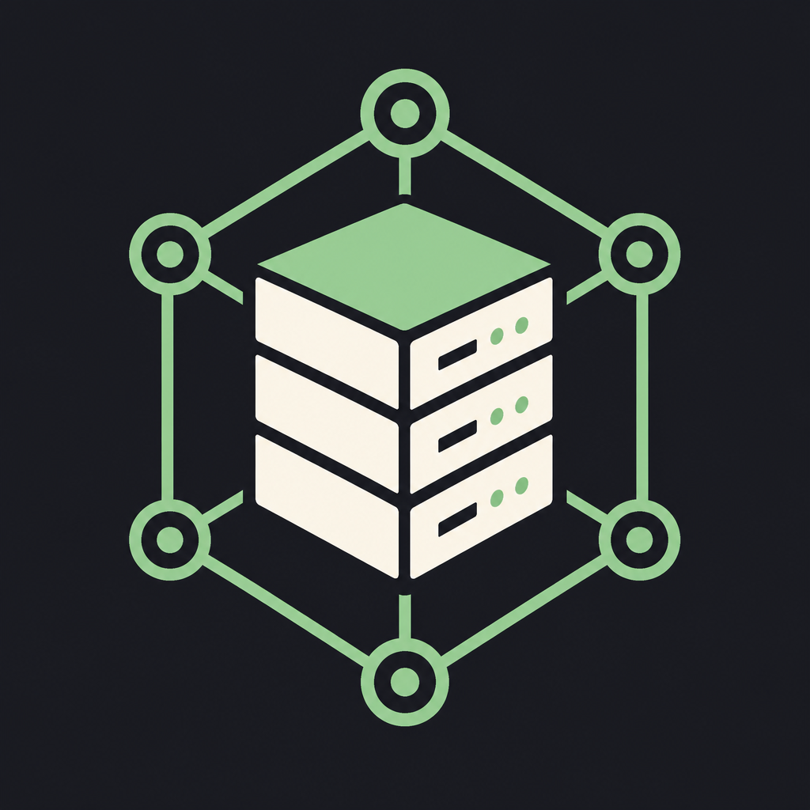

<div align="center">



# Minecraft Nexus Panel

**A multi-node Minecraft server management platform for web, desktop, and mobile operations.**

English | [简体中文](README.zh_CN.md)

</div>

## Current M2 Scope

The current M2 domain and template catalog model 29 server, proxy, and Bedrock-facing profiles:

| Profile | Types |
|---------|-------|
| Java vanilla | Vanilla |
| Java modded | NeoForge, Forge, Fabric |
| Java plugins | Bukkit, Spigot, Paper, Purpur, Pufferfish, Folia, Leaf |
| Java hybrid | Mohist, Magma, Sponge, Arclight, Youer, AsyncYouer, Silkard, CatServer, Lingshu |
| Proxies | Velocity, Waterfall, BungeeCord, Lightfall, Geyser |
| Bedrock servers | Bedrock Dedicated Server, PocketMine-MP, Nukkit, Cloudburst Nukkit |

The catalog distinguishes a server profile from a verified installer. Version metadata currently covers Vanilla, Paper, Velocity, Fabric, NeoForge, Forge, Bukkit, Spigot, Purpur, Pufferfish, Folia, Leaf, Mohist, Youer, Silkard, Magma, Sponge, Arclight, CatServer, Waterfall, BungeeCord, Lightfall, Geyser, Bedrock Dedicated Server, PocketMine-MP, Nukkit, and Cloudburst Nukkit providers. NeoForge uses the official Maven XML catalog, Pufferfish aggregates five official Jenkins jobs, Bukkit and Spigot use official Jenkins RSS Atom feeds, Mohist and Youer use MohistMC's public project API, Silkard uses the official GitHub branches API, GitHub release providers require JAR/PHAR assets, BDS uses Mojang's official download-links API for Windows/Linux stable and Preview ZIPs, and Nukkit variants use OpenCollab Maven metadata; Sponge currently reflects legacy official SpongeVanilla releases and Magma primarily exposes development builds. RSS, archive, build, project, and branch metadata do not by themselves verify a directly installable server artifact. Archive layouts, launch recipes, and installation validation remain incremental for every profile.

- Hybrid servers manage plugins and mods separately, with extension directories declared by the template and version rather than assumed globally; the domain catalog resolves those directories per extension kind.
- Panel can now scan extensions by template and `PLUGIN`/`MOD` kind, return each declared directory as a separate file page, place or update a prepared local artifact through bounded atomic writes with optional `If-Match`, persist its local installation metadata, and asynchronously delete one file after explicit confirmation and idempotency validation. The corresponding installation record is removed only after the Core deletion task succeeds; failed or timed-out deletion keeps the record, and a newer installation at the same path is never removed by an older task. The extension catalog searches Modrinth MOD/PLUGIN projects with Minecraft version, loader, and pagination filters, reads project versions and dependency records, and resolves a bounded required-dependency plan. Installation re-resolves that plan into a queryable in-memory task, downloads only HTTPS Modrinth artifacts, verifies their declared size and SHA-512, uploads them to a selected template directory through Core `transfer-v1` chunks, and records each committed source installation. New multi-file installs reject existing targets before writing and compensate-delete committed files after a failure when the file hash and installation record still match; task results expose `rollbackState`. A persisted Modrinth extension can now start a source update task that re-resolves its target version, replaces only the root artifact, and protects the recorded SHA-256 through Core upload-session preconditions. The shared TypeScript Client exposes these operations and task queries. Reusing an `Idempotency-Key` for the same Core, instance, extension kind, and operation returns the original task without starting a duplicate download. Multi-directory installs require an explicit directory; tasks do not resume across Panel restarts, and Core-side unified tasks, additional source adapters, and batch updates remain planned.
- Velocity, Waterfall, BungeeCord, and Lightfall use one-to-many backend topology; Geyser uses one-to-one topology and has dedicated Bedrock-facing management. Panel can request a bounded TCP plus Minecraft Java Status protocol check from the registered Core node for each backend relationship, with separate network and protocol status fields.
- Proxy actions can orchestrate enabled backend instances on the registered Core: start backends before the proxy, stop the proxy before backends, de-duplicate repeated targets, honor `includeBackends` and stop timeouts, and report partial failures without claiming blocked steps succeeded.
- Bedrock Dedicated Server, PocketMine-MP, Nukkit, Cloudburst Nukkit, and Geyser expose dedicated management profiles for RakNet UDP, the default bind address, configuration files, extension capabilities, declared extension directories, configuration format, and extension compatibility policy. Core reads `server-ip`/`server-port` or Geyser's `bedrock.address`/`bedrock.port` where supported, accepts IP literals only, falls back to `0.0.0.0` and `19132` independently when configuration is unavailable or invalid, and reports the address/port sources plus whether that UDP binding is available, occupied, or unavailable. The profile policy is currently declarative; version-specific plugin manifest/API checks remain planned.
- Core also exposes a dedicated Bedrock health action using RakNet Unconnected Ping/Pong. It reports response, timeout, invalid response, and probe-unavailable states, returns the server identity when valid, and probes loopback when the configured bind address is unspecified; this is separate from the UDP port bind check and Java Status health check.
- Instance launch configuration now separates HOST/CONTAINER runtime mode from DIRECT/MCDR supervision. HOST supports direct commands and explicit MCDR `{server}`/`{serverArgs}` wrapper templates; CONTAINER is stored but rejected until the container backend exists.
- Core records instance start success/failure, stop and force-kill requests, and unexpected supervised-process exits. MCDR wrapper exits receive a dedicated failure reason, and the newest records can be queried through `instance.audit.list`, Panel REST, and the shared TypeScript Client. Records are currently Core-memory only and do not replace durable user-level audit logs.

### File Management Slice

The first file-management slice is now available through the Core `files` capability and Panel API:

- sandboxed directory listing with pagination;
- 32 KiB chunked reads with full-file SHA-256 and EOF metadata;
- atomic writes up to 1 MiB with optional `ETag`/`If-Match` protection and idempotency keys;
- recursive directory creation and same-instance moves with overwrite and non-empty-directory guards;
- asynchronous file and recursive-directory deletion with explicit `DELETE` confirmation, task polling, and path-safety guards;
- ordered batch file tasks for `MKDIR`, `MOVE`, `WRITE`, and `DELETE`, with per-item progress and partial-failure results;
- asynchronous ZIP archive preparation for up to 128 files or directories, including empty directories and the instance root, with entry progress and atomic output;
- session-based chunked uploads with fixed 1 MiB parts, per-part and full-file SHA-256 checks, optional target `ETag`/`If-Match` protection, ordered offsets, retries, cancellation, and atomic replacement;
- session-based chunked downloads with fixed 1 MiB parts, full-file and per-part SHA-256 metadata, ordered offsets, retryable completed parts, and completion verification;
- binary Panel responses and TypeScript Client methods for the same contract.

Archive creation and session-based large-file downloads are available. Cross-restart transfer resume, snapshots, difference comparison, and unified task-center progress remain planned M3 work.

### Configuration Management Slice

The first configuration provider is now available through Core TCP and the Panel API:

- recursive discovery of UTF-8 `.properties` documents up to 1 MiB;
- JSON Schema/UI Schema values with stable path-derived document IDs and SHA-256 revisions;
- lossless top-level scalar Merge Patch updates for properties files that preserve comments, ordering, and line endings;
- JSON object discovery with typed JSON Schema/UI Schema and nested top-level Merge Patch updates; normalized writes require explicit `allowLossy=true`;
- YAML/YML and TOML object discovery with typed JSON Schema/UI Schema and normalized top-level Merge Patch updates; writes require explicit `allowLossy=true`;
- Minecraft `server.properties` metadata for common booleans, integers, difficulty/gamemode enums, and a sensitive password widget for `rcon.password`; unknown keys remain strings;
- raw text reads and writes with the same sandbox, ETag, If-Match, and idempotency protections as file management.
- instance-level `config-documents:validate` diagnostics for Java ports, Query/RCON settings, `server-ip`, `eula.txt`, Geyser endpoints, and duplicate listening ports.

Complex structured controls, version-specific schemas, and broader cross-file rules remain planned M3 work.

### CPU Topology Slice

Core now caches a conservative host CPU topology snapshot at startup and exposes it through
`cpu.topology` and `GET /api/v1/cores/{coreId}/cpu-topology`:

- architecture, visible logical CPUs, and physical core count when the platform reports it;
- explicit `UNKNOWN` performance classes when performance/efficiency information is unavailable;
- detection source and confidence, with no CPU-index-based performance guesses.

- Linux Core now reads sysfs topology, process cpuset, ARM `cpu_capacity`, NUMA, online/offline,
  and isolation data; unavailable fields remain explicit unknown values.
- Core and Panel now provide a read-only CPU policy preview plus Core-local `cpu-reservations`
  registration, listing, conflict checking, and release with an instance revision precondition.
  A reservation records selected CPU IDs only; it does not prove host affinity or Docker cpuset
  application and is not restored across a Core restart.
Windows EfficiencyClass, actual CPU affinity/cpuset application, durable reservations, and instance
policy persistence remain planned M4 work.

## Project Layout

```text
apps/
  nexus/              Unified CLI entry point for core, panel, and all modes
  desktop/src-tauri/  Tauri Desktop shell
  mobile/src-tauri/   Tauri Mobile shell
crates/
  nexus-domain/       Shared domain types
  nexus-protocol/     Core TCP protocol
  nexus-core/         Node and instance execution capabilities
  nexus-panel/        HTTP, authentication, and Core connection pool
  nexus-storage/      SQLite/PostgreSQL storage implementations
  nexus-config/       Configuration loading and runtime modes
frontend/
  app/                Shared Vue 3 application for Web, Desktop, and Mobile
  api-client/         Package for the generated OpenAPI client
  ui/                 Shared components and design tokens
  platform/           Browser/Tauri platform adapters
```

## Local Commands

```powershell
cargo test --workspace
cargo run -p mcnp -- all

pnpm install
pnpm typecheck
pnpm build
pnpm dev
```

See [PLAN.md](PLAN.md) and the [API documentation](docs/api/README.md) for the protocol design and product scope.
