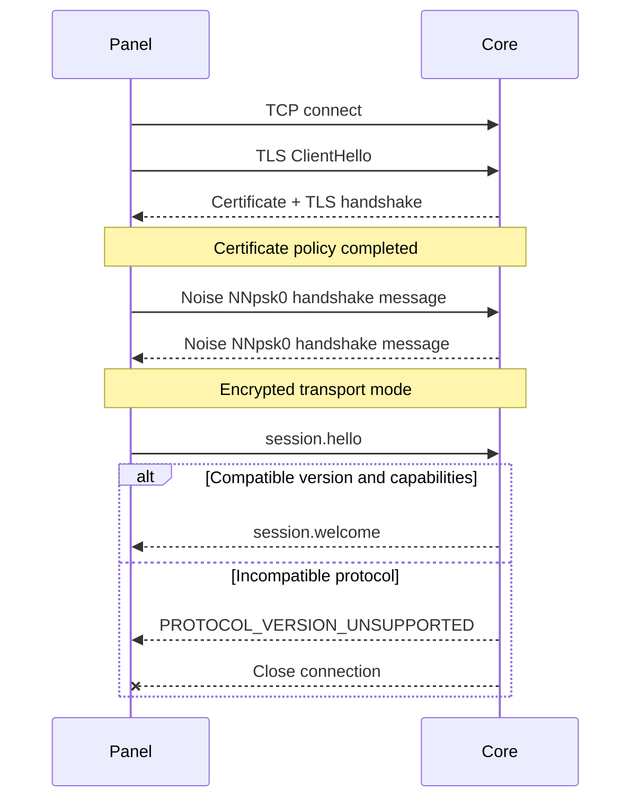

# MCNP Core TCP 协议 v1

## 1. 作用域

本协议用于 Panel 与 Core 之间的管理通信。Core 监听 TCP，Panel 主动连接。协议负责节点管理能力，不负责 Minecraft
客户端查询、终端用户登录或浏览器通信。

设计目标：

- 使用连接密钥进行双向认证并加密全部业务数据。
- 支持一个 Panel 管理多个 Core，也支持多个获授权 Panel 连接同一 Core。
- 支持请求/响应、异步事件、心跳、取消和大文件分块传输。
- 能在同一主版本内增量增加方法和字段。

## 2. 传输与安全

### 2.1 连接

- 默认监听地址：`0.0.0.0:25580`，必须允许配置。
- TCP keepalive 建议为 30 秒，空闲连接每 20 秒发送应用层 Ping。
- 连接、握手和单个请求必须分别配置超时。
- Core 应限制单 IP 的并发握手数，错误密钥不得返回可区分的详细原因。

### 2.2 TLS 服务器身份

Core TCP 必须先建立 TLS，再在 TLS 流内执行 Noise PSK 握手：

1. Core 可通过 `MCNP_CORE_TLS_CERT` 和 `MCNP_CORE_TLS_KEY` 配置 PEM 证书链与私钥，两项必须同时提供。
2. 未配置时，Core 在数据目录的 `tls/core-cert.pem` 和 `tls/core-key.pem` 生成并持久化自签名密钥对；不会在每次启动时轮换。
3. Panel 使用 IP 地址、`localhost` 或 `*.localhost` 连接时不校验证书链和主机名；仍校验 TLS 握手签名，并继续要求正确的 Noise PSK。
4. Panel 使用 `tls://`、`mcnp://` 或 `https://` 域名 URL 时，默认校验证书有效期、信任链和 DNS 名。用户显式选择
   `skipCertificateVerification` 后才可跳过该校验。
5. 自动生成的自签名证书不能通过域名严格验证。域名部署必须配置受信任 CA 签发的证书，或由管理员显式选择跳过验证。

Core 在 TLS 握手中自动发送证书链。Panel 在证书校验完成后才进入 Noise 握手，并核对 `session.welcome` 中的
`tlsCertificateSha256` 与 TLS 对端叶证书指纹一致。不能把 Core 在同一连接中自报的公钥或指纹当成独立信任来源。

TLS 1.2/1.3 使用 ECDHE 协商并派生对称会话密钥，不在网络上传输 AES 密钥。不得设计自定义“公钥加密 AES 密钥”握手。

### 2.3 Noise PSK

v1 使用 `Noise_NNpsk0_25519_ChaChaPoly_BLAKE2s`：

1. 管理员在 Core 生成至少 32 字节随机连接密钥。
2. 文本形式使用无填充 Base64URL；PSK 派生为 `HKDF-SHA256(secret, salt="mcnp-core-psk-v1")` 的 32 字节结果。
3. Noise prologue 固定为 UTF-8 `MCNP/1`。
4. Panel 为 initiator，Core 为 responder。
5. 握手成功后，所有应用帧均由 Noise transport mode 加密。

PSK 不能写入日志或命令行参数。Core 优先从环境变量、系统凭据或权限受限的配置文件读取；Panel 必须使用主密钥加密后落库。

> Noise PSK 能保证持有同一密钥的双方身份与机密性，但不能区分共享该密钥的不同 Panel。需要独立撤销时，应为每个 Panel
> 分配独立密钥记录。

### 2.4 帧

网络字节序为 big-endian：

```text
+----------------------+--------------------------+
| ciphertextLength u32 | Noise ciphertext bytes   |
+----------------------+--------------------------+
```

- 握手消息也使用 `u32 length + handshake bytes`。
- 单个密文帧最大 65,535 字节，解密后的 JSON 最大 60 KiB。
- 超限、截断、解密失败或非法 JSON 立即关闭连接。
- 每个加密帧恰好包含一个 UTF-8 JSON 对象，不允许拼接多个对象。
- 大文件和长日志必须分页或分块，不能提高全局帧上限。

## 3. 会话建立

TLS 与 Noise 握手完成后，Panel 必须首先发送 `session.hello`，Core 在接受任何其他消息前返回 `session.welcome`。



```json
{
  "type": "request",
  "requestId": "0198...",
  "method": "session.hello",
  "params": {
    "protocol": {
      "major": 1,
      "minor": 0
    },
    "panelId": "0198...",
    "panelName": "Shanghai Panel",
    "clientVersion": "0.1.0",
    "capabilities": [
      "events",
      "files",
      "transfer-v1"
    ]
  }
}
```

```json
{
  "type": "response",
  "requestId": "0198...",
  "ok": true,
  "result": {
    "protocol": {
      "major": 1,
      "minor": 0
    },
    "coreId": "0198...",
    "coreName": "Game Node 01",
    "serverVersion": "0.1.0",
    "capabilities": [
      "events",
      "files",
      "metrics",
      "transfer-v1"
    ],
    "sessionId": "0198...",
    "tlsCertificateSha256": "64-character-lowercase-hex",
    "heartbeatSeconds": 20
  }
}
```

- 主版本不一致时返回 `PROTOCOL_VERSION_UNSUPPORTED` 后关闭连接。
- 次版本取双方均支持的较小值。
- 能力必须通过交集协商；未协商的可选方法返回 `METHOD_NOT_SUPPORTED`。
- `coreId` 在首次启动时生成并持久化，不能随重启变化。
- `tlsCertificateSha256` 必须与当前 TLS 对端叶证书的 SHA-256 指纹一致。

## 4. 消息模型

### 4.1 请求

```json
{
  "type": "request",
  "requestId": "0198b20c-0fa1-7aef-84f2-bba7c5b15dd0",
  "method": "instance.start",
  "params": {
    "instanceId": "survival"
  },
  "deadline": "2026-07-30T10:15:45Z",
  "idempotencyKey": "0198b20c-0fac-7ad4-a43d-164898078799"
}
```

- `requestId`：当前连接内唯一，响应必须原样返回。
- `deadline`：可选；Core 不应开始执行已过期请求。
- `idempotencyKey`：危险或可重试写操作使用。Core 至少保存最近 24 小时的执行结果。
- 同一连接允许并发请求，响应顺序不作保证。

### 4.2 成功响应

```json
{
  "type": "response",
  "requestId": "0198b20c-0fa1-7aef-84f2-bba7c5b15dd0",
  "ok": true,
  "result": {
    "taskId": "0198b20c-127e-73dc-bc5d-c7fb4290e58e",
    "acceptedAt": "2026-07-30T10:15:31Z"
  }
}
```

### 4.3 错误响应

```json
{
  "type": "response",
  "requestId": "0198b20c-0fa1-7aef-84f2-bba7c5b15dd0",
  "ok": false,
  "error": {
    "code": "INSTANCE_STATE_CONFLICT",
    "message": "Instance is already running",
    "retryable": false,
    "details": {
      "state": "RUNNING"
    }
  }
}
```

错误码见 [`errors.md`](errors.md)。`message` 用于开发和日志，不作为 UI 的稳定文案键。

### 4.4 事件

```json
{
  "type": "event",
  "eventId": "0198b20c-1a37-7cc7-8ca5-297e6c7d9fe1",
  "topic": "instance.console",
  "sequence": 1842,
  "occurredAt": "2026-07-30T10:15:32.415Z",
  "data": {
    "instanceId": "survival",
    "stream": "stdout",
    "line": "[Server thread/INFO]: Done (3.201s)!",
    "cursor": "1842"
  }
}
```

- `sequence` 在一个 Core 会话内单调递增，不要求跨重启连续。
- 可靠恢复依赖各主题自己的 `cursor`，例如控制台日志游标。
- Panel 必须忽略未知 topic，并记录一次可限流的调试日志。
- `instance.state` 在实例进入 `STARTING`、`RUNNING`、`STOPPING`、`STOPPED` 或 `FAILED` 时发布，`data` 包含
  `instanceId` 和完整 `runtime`。
- 当前 `event.subscribe` 支持 `instance.state` 和 `instance.console`，Core 只转发订阅中明确列出的 topic。

## 5. 方法

### 5.1 会话与节点

| 方法                | 参数                     | 结果                   | 说明                 |
|---------------------|--------------------------|------------------------|----------------------|
| `session.hello`     | 版本、Panel 信息、能力   | Core 信息、协商结果    | 每条连接的首个请求   |
| `system.ping`       | `sentAt`                 | `receivedAt`           | 心跳与 RTT           |
| `system.info`       | 无                       | 系统、版本、容量、能力 | 不返回敏感环境变量   |
| `system.shutdown`   | `graceSeconds`           | `taskId`               | 仅显式启用时可用     |
| `event.subscribe`   | topics、filters、cursors | subscriptionId         | 订阅事件             |
| `event.unsubscribe` | subscriptionId           | 空对象                 | 取消订阅             |
| `request.cancel`    | targetRequestId          | accepted               | 尽力取消，不保证成功 |

### 5.2 实例

| 方法               | 参数                                  | 结果              |
|--------------------|---------------------------------------|-------------------|
| `instance.list`    | cursor、limit、state                  | items、nextCursor |
| `instance.get`     | instanceId                            | Instance          |
| `instance.create`  | InstanceCreate                        | Instance          |
| `instance.update`  | instanceId、revision、patch           | Instance          |
| `instance.delete`  | instanceId、deleteFiles、confirmation | taskId            |
| `instance.start`   | instanceId                            | taskId            |
| `instance.stop`    | instanceId、timeoutSeconds            | taskId            |
| `instance.restart` | instanceId、timeoutSeconds            | taskId            |
| `instance.kill`    | instanceId、confirmation              | taskId            |
| `instance.command` | instanceId、command                   | acceptedAt        |
| `instance.logs`    | instanceId、after、before、limit      | items、nextCursor |
| `instance.metrics` | instanceId、range、resolution         | series            |

实例写入使用 `revision` 做乐观锁。启动/停止等状态操作必须提供 `idempotencyKey`。命令最大 8 KiB，移除尾部换行后由 Core
追加一个平台正确的换行；空命令、包含 NUL 的命令会被拒绝，命令内容不会由 Core 写入控制台日志。

控制台日志按实例保留最近 10,000 行内存历史，stdout 和 stderr 各行合并到同一单调游标空间。单行正文最多 64 KiB，超出部分以
` [truncated]` 结尾；非 UTF-8 输出使用替换字符解码。`after` 用于向后追读，`before` 用于向前翻页，`limit` 默认为 50、最大为
200。Core 重启后内存历史和游标基线会重置。

M1 的 `instance.metrics` 返回一个当前进程样本组成的 `series`，字段包括 `occurredAt`、`cpuPercent`、`memoryBytes`、
`virtualMemoryBytes` 和 `uptimeSeconds`。`range` 与 `resolution` 当前仅作为后续历史采样能力的兼容参数。

### 5.3 文件

所有路径都相对于实例根目录，使用 `/` 分隔。Core 必须在解析符号链接后的真实路径上再次确认目标仍位于实例根目录内。

| 方法              | 参数                                               | 结果                    |
|-------------------|----------------------------------------------------|-------------------------|
| `file.list`       | instanceId、path、cursor、limit                    | `FilePage`              |
| `file.read`       | instanceId、path、offset、length                   | `FileContent`           |
| `file.write`      | instanceId、path、dataBase64、expectedSha256       | `FileEntry`             |
| `file.mkdir`      | instanceId、path、recursive                        | entry                   |
| `file.move`       | instanceId、from、to、overwrite                    | entry                   |
| `file.delete`     | instanceId、path、recursive、confirmation          | taskId                  |
| `file.batch`      | instanceId、operations                             | taskId                  |
| `file.archive.create` | instanceId、format、paths、outputPath           | taskId                  |
| `file.task.get`   | taskId                                             | `FileTask`         |
| `transfer.begin`  | UPLOAD: instanceId、path、size、sha256、可选 expectedSha256；DOWNLOAD: instanceId、path、mode | transferId、chunkSize、nextOffset、sizeBytes、sha256 |
| `transfer.chunk`  | UPLOAD: transferId、offset、dataBase64；DOWNLOAD: transferId、offset | 上传 nextOffset；下载 dataBase64、分片 sha256 和游标 |
| `transfer.commit` | transferId                                         | 上传 entry；下载空对象  |
| `transfer.abort`  | transferId                                         | 空对象                  |

- `file.read` 单次最多读取 32 KiB 原始字节。
- `file.list` 的 `limit` 默认为 50，最大为 200；`file.read` 的 `length` 必须为 1 至 32 KiB，`eof` 表示本次读取是否到达文件末尾，`sha256` 始终是完整文件摘要。
- `file.write` 当前最多接收 1 MiB 原始字节，要求请求携带 `idempotencyKey`，并在提供 `expectedSha256` 时校验完整文件摘要；Core 在同一目录使用临时文件完成原子替换。
- `file.mkdir` 支持递归创建目录；`file.move` 仅允许在实例根目录内移动，支持可选覆盖，但拒绝覆盖非空目录，并且两者都要求 `idempotencyKey`。
- `file.delete` 要求携带 `idempotencyKey` 和字面值为 `DELETE` 的 `confirmation`；默认只删除文件或空目录，`recursive=true` 才删除非空目录。请求接受后返回任务，使用 `file.task.get` 查询 `RUNNING`、`SUCCEEDED` 或 `FAILED` 状态。
- `file.batch` 要求 `idempotencyKey`，一次最多 64 项，支持 `MKDIR`、`MOVE`、`WRITE` 和 `DELETE`。操作按数组顺序在后台任务中执行，任务进度包含 `completed`/`total`，结果包含每项状态；失败时保留已完成项和失败索引，不执行伪回滚。
- `file.archive.create` 要求 `idempotencyKey` 和 `format: "ZIP"`，一次最多 128 个源路径；递归结果最多 16,384 个 ZIP 条目，未压缩源数据最多 4 GiB。路径可指向文件、目录或实例根目录，输出路径必须位于实例目录内且父目录已存在。Core 按条目写入同目录临时文件，完成后原子落盘；目录条目、空目录和文件内容都会写入 ZIP，输出归档不会再次包含自身。任务 kind 为 `FILE_ARCHIVE_CREATE`，进度为已处理归档条目数/总数，成功结果的 `archive` 字段为 `FileEntry`，超限返回 `PAYLOAD_TOO_LARGE`。
- 当前 Core 已实现 `file.list`、`file.read`、`file.write`、`file.mkdir`、`file.move`、`file.delete`、`file.batch`、`file.archive.create`、`file.task.get` 和 `transfer.*`，并通过 `files` 与 `transfer-v1` capability 协商。
- `transfer.begin` 接受 `UPLOAD` 和 `DOWNLOAD` 两种模式；单文件最多 4 GiB，返回固定 1 MiB 的 `chunkSize` 和从 0 开始的 `nextOffset`。下载模式会在初始化时记录源文件大小和完整 SHA-256。
- 上传 `transfer.begin` 若携带 `expectedSha256`，会在创建临时会话前校验目标文件当前摘要；摘要不匹配返回 `FILE_REVISION_MISMATCH`，不会创建可继续提交的上传会话。
- 上传 `transfer.chunk` 必须按服务端返回的 offset 顺序提交；相同 offset 的相同内容允许重试，提交前写入同文件系统临时文件。下载 `transfer.chunk` 不携带 `dataBase64`，按 offset 返回 Base64 分片、分片 SHA-256、完整文件摘要和 EOF；已读分片可以重试，跳跃到未到达的 offset 会被拒绝。每个分片最多 1 MiB。
- `transfer.commit` 对上传先校验完整文件大小和 SHA-256，再原子替换目标；对下载校验已经读完且源文件摘要未变化。`transfer.abort` 删除上传临时文件或释放下载状态。
- 每个 Core 最多同时保留 16 个上传会话和 16 个下载会话；会话状态保存在内存中，Core 重启会清理未完成会话。归档生成和归档文件的分块读取已支持，但跨重启续传、快照、差异比较和统一任务中心进度仍属于后续版本。

### 5.4 任务

| 方法          | 参数                 | 结果              |
|---------------|----------------------|-------------------|
| `task.get`    | taskId               | Task              |
| `task.list`   | cursor、limit、state | items、nextCursor |
| `task.cancel` | taskId               | accepted          |

任务状态为 `QUEUED | RUNNING | SUCCEEDED | FAILED | CANCELLED`。进度字段为 `0..1`，未知进度时为 `null`。

### 5.5 受管环境与一键搭建

| 方法                | 参数                   | 结果                   |
|---------------------|------------------------|------------------------|
| `runtime.list`      | kind、cursor、limit    | items、nextCursor      |
| `runtime.install`   | manifest、setAsDefault | taskId                 |
| `runtime.verify`    | runtimeId              | taskId                 |
| `runtime.delete`    | runtimeId              | taskId                 |
| `provision.resolve` | ProvisionPlan          | resolvedPlan、planHash |
| `provision.execute` | resolvedPlan、planHash | taskId、instanceId     |
| `provision.task.get` | taskId                 | task                   |

Core 只接受 Panel 已解析的精确 manifest：下载 URL、大小、SHA-256、目标目录和受限安装步骤。Core 必须再次校验平台/架构、摘要、可用空间和路径，不信任
Panel 传来的预检结果。

`runtime.install` 的 manifest 还必须声明运行时 ID、发行版、版本、`ZIP` 或 `TAR_GZ` 压缩格式以及相对可执行文件路径。
Core 将压缩包解压到受管 runtime 目录的临时目录，完成可执行文件检查后原子切换；缓存命中时复用已校验的 SHA-256 文件。
压缩包中的绝对路径、父目录、符号链接和特殊文件会被拒绝。`runtime.verify` 重新执行版本探测，`runtime.delete` 会拒绝删除被实例启动命令引用的 runtime。

`provision.resolve` 校验模板类型、运行时要求、目标平台/架构、实例目录和归档内的可执行文件路径，并对完整计划计算
`planHash`。`provision.execute` 只接受相同的完整计划和 hash；Core 下载归档、验证 SHA-256、安全解压并原子创建实例目录，任务状态通过
`provision.task.get` 查询。归档存在符号链接、特殊文件、绝对路径或父目录时会被拒绝。

### 5.5.1 代理子服务器

| 方法                    | 参数                                  | 结果                  |
|-------------------------|---------------------------------------|-----------------------|
| `proxy.subserver.list`  | proxyInstanceId                       | items                 |
| `proxy.subserver.upsert`| proxyInstanceId、subserver            | ProxySubserver        |
| `proxy.subserver.delete`| proxyInstanceId、subserverId          | 空对象                |
| `proxy.subserver.check` | proxyInstanceId、subserverId          | ProxySubserverHealth  |

Core 只允许 `VELOCITY`、`WATERFALL`、`BUNGEECORD`、`LIGHTFALL` 和 `GEYSER` 实例使用这些方法。
一对多代理可以维护多个目标；Geyser 的一对一拓扑最多维护一个目标。每个目标必须指向已存在的非代理实例，
变更请求必须带 `idempotencyKey`。
`proxy.subserver.check` 从 Core 节点对启用的目标执行最多 3 秒 TCP 探测；连接失败作为 `UNREACHABLE` 健康结果返回，禁用目标返回 `DISABLED`，不会伪装成 Core 注册错误。

### 5.5.2 基岩端运维画像

| 方法              | 参数       | 结果                                      |
|-------------------|------------|-------------------------------------------|
| `bedrock.profile` | instanceId | transport、defaultPort、配置文件和扩展类型 |

该方法仅对 Bedrock Dedicated Server、PocketMine-MP、Nukkit、Cloudburst Nukkit 和 Geyser 返回结果。
画像统一标记 RakNet UDP 与默认端口 `19132`，同时区分 `server.properties`、Geyser `config.yml` 和可管理插件类型。

### 5.6 配置与扩展

| 方法                | 参数                                                | 结果                               |
|---------------------|-----------------------------------------------------|------------------------------------|
| `config.scan`       | instanceId                                          | documents                          |
| `config.get`        | instanceId、documentId                              | schema、uiSchema、values、revision |
| `config.patch`      | instanceId、documentId、revision、patch、allowLossy | document                           |
| `extension.scan`    | instanceId                                          | installs                           |
| `extension.install` | instanceId、resolvedPlan                            | taskId                             |
| `extension.update`  | instanceId、extensionId、resolvedPlan               | taskId                             |
| `extension.delete`  | instanceId、extensionId                             | taskId                             |

Panel 聚合内容源并完成依赖解析；Core 根据带摘要的 resolved plan 下载和原子替换。Core 不直接保存第三方 API Token，除非该凭据被配置为
Core 侧 Secret 且协议仅传引用 ID。

当前 Core 已实现 `PROPERTIES`、`JSON`、`YAML` 和 `TOML` 提供者：`config.scan` 递归发现 `.properties`、`.json`、`.yaml`/`.yml` 与 `.toml` 文件，`config.get` 返回 JSON Schema、UI Schema、结构化值、未映射文本、内容
SHA-256 `revision`/`contentHash` 和稳定的路径派生 `documentId`。`config.patch` 要求幂等键和当前 revision，并通过原子文件替换；properties 补丁只接受顶层字符串、布尔、数字或 `null`，保留注释、键顺序和换行，结构化格式补丁支持嵌套 Merge Patch 但只有显式 `allowLossy=true` 才允许规范化写回。Panel 可通过对应 raw 端点读取或替换最多 1 MiB 的 UTF-8 原文。
provider-specific Schema 和跨文件校验仍需后续 provider。

### 5.7 Docker

| 方法                 | 参数                                           | 结果                          |
|----------------------|------------------------------------------------|-------------------------------|
| `docker.info`        | 无                                             | Engine 版本、平台、能力与策略 |
| `image.list`         | filters、cursor、limit                         | items、nextCursor             |
| `image.pull`         | reference、registryCredentialRef               | taskId                        |
| `image.delete`       | imageId、force                                 | taskId                        |
| `image.build`        | contextTransferId、dockerfile、tags、buildArgs | taskId                        |
| `container.validate` | instanceId、ContainerConfig                    | normalizedConfig、warnings    |
| `container.inspect`  | instanceId                                     | containerState                |

Core 必须在执行前应用本地安全策略：禁止特权容器、Docker socket、越界挂载和未授权 host network。Panel 不能通过协议参数关闭
Core 的强制策略。

### 5.8 大核调度与 CPU 亲和

| 方法                        | 参数                            | 结果                                  |
|-----------------------------|---------------------------------|---------------------------------------|
| `cpu.topology`              | 无                              | CpuTopology                           |
| `cpu.policy.resolve`        | CpuPolicy、instanceId           | candidates、conflicts、degradedReason |
| `cpu.reserve`               | instanceId、CpuPolicy、revision | reservationId、appliedPolicy          |
| `cpu.release`               | reservationId                   | 空对象                                |
| `instance.cpu_policy.get`   | instanceId                      | requested、applied、status            |
| `instance.cpu_policy.apply` | instanceId、policy、strict      | taskId、status                        |

- Core 必须在实例子进程创建前应用 host affinity；Docker 实例映射为 cpuset-cpus/cpuset-mems。
- `shareMode=EXCLUSIVE` 需要 Core 侧 CpuReservation，冲突时返回 `CPU_CAPACITY_UNAVAILABLE`。
- 识别不到性能类别时，`PERFORMANCE` 不得按编号猜测；`strict=true` 失败，`strict=false` 只能返回 `DEGRADED`。
- Core 事件包含 requested policy、applied CPU IDs、性能类别、reservationId 和降级原因。

### 5.9 计划任务

| 方法                  | 参数                                  | 结果              |
|-----------------------|---------------------------------------|-------------------|
| `schedule.list`       | instanceId                            | schedules         |
| `schedule.get`        | instanceId、scheduleId                | schedule          |
| `schedule.upsert`     | instanceId、schedule、revision        | schedule          |
| `schedule.delete`     | instanceId、scheduleId、revision      | 空对象            |
| `schedule.run`        | instanceId、scheduleId                | taskId            |
| `schedule.executions` | instanceId、scheduleId、cursor、limit | items、nextCursor |

计划定义由 Panel 保存权威副本并同步到 Core；Core 持久化本地副本和执行游标，因此 Panel 暂时断开时仍可执行。重连后按
execution ID 汇合结果，禁止重复补跑。

## 6. 核心数据结构

### Instance

```json
{
  "id": "survival",
  "name": "Survival",
  "revision": 7,
  "kind": "PAPER",
  "expiresAt": null,
  "workingDirectory": "instances/survival",
  "runtimeId": "java-temurin-21.0.8-x64",
  "launchCommand": {
    "executable": "{runtime.java}",
    "args": [
      "-Xms1G",
      "-Xmx4G",
      "-jar",
      "paper.jar",
      "nogui"
    ],
    "environment": {},
    "stopCommand": "stop",
    "stopTimeoutSeconds": 30
  },
  "updateCommand": {
    "templateAction": "paper.update"
  },
  "execution": {
    "runtimeMode": "HOST",
    "supervisorMode": "DIRECT",
    "mcdr": null,
    "container": null
  },
  "runtime": {
    "state": "RUNNING",
    "pid": 14273,
    "startedAt": "2026-07-30T10:12:12Z",
    "exitCode": null
  }
}
```

### Task

```json
{
  "id": "0198...",
  "kind": "INSTANCE_START",
  "state": "RUNNING",
  "progress": null,
  "createdAt": "2026-07-30T10:15:31Z",
  "startedAt": "2026-07-30T10:15:31Z",
  "finishedAt": null,
  "error": null
}
```

## 7. 超时、重试与重连

- 查询默认超时 10 秒，状态操作 30 秒，文件/安装任务仅等待“已接受”响应。
- Panel 只自动重试查询和携带相同 `idempotencyKey` 的写操作。
- 重连使用带随机抖动的指数退避：1、2、4、8、16、30 秒，之后保持 30 秒上限。
- 连接断开不等于任务失败；Panel 重连后通过 `task.get` 或实例状态确认结果。
- Core 每次重启生成新的 `bootId`；Panel 发现变化后清空会话级 sequence，并使用业务 cursor 恢复订阅。

## 8. 密钥轮换

Core 可同时保留一个 active key 和一个有过期时间的 retiring key：

1. 管理员在 Core 创建新 key，获得一次性明文。
2. Panel 更新加密保存的 key，并成功建立新连接。
3. Panel 确认轮换，Core 将旧 key 标记为 retiring。
4. 宽限期结束或管理员确认后撤销旧 key。

轮换管理默认通过 Core 本地 CLI 完成，避免“仅剩失效网络密钥时无法恢复”的死锁。

## 9. 必测协议场景

- 错误 PSK、不同主版本、重复 `requestId`、未知方法。
- 长度为 0、超过上限、截断、篡改密文和非法 UTF-8/JSON。
- 请求超时后响应晚到、响应乱序、连接中途断开。
- 重复 `idempotencyKey` 返回同一结果且不重复启动实例。
- `..\`、绝对路径、符号链接和大小写差异导致的目录穿越。
- 上传断点、SHA-256 不匹配、磁盘满和原子替换失败。
- 环境/模板/扩展下载摘要错误、恶意压缩包、计划任务重复触发和 Docker 越权参数。
