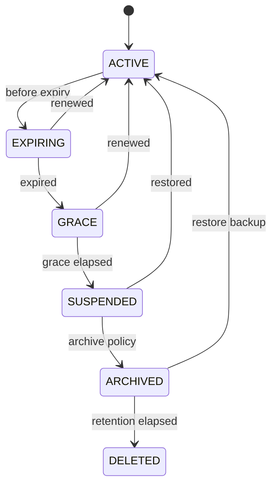

# 商业服务商 API 规划

## 1. 作用域

Provider API 面向订单、计费、客户门户和自动化系统，不直接面向普通服主 UI。它使用独立基础路径 `/api/provider/v1`，但复用 Panel
的 Instance、Task、AuditEvent 和幂等基础设施。

商业模块关闭时，Provider API 不注册路由，不影响社区部署。

## 2. 鉴权与隔离

- 外部系统使用前缀为 `mcnp_provider_` 的不透明 API Key。
- Key 只保存 Argon2id/快速索引组合摘要，支持 scopes、tenant 限定、IP allowlist、到期和轮换。
- 控制台中的提供商管理员使用普通用户会话 + provider 权限，不复用外部 API Key。
- 每个请求产生 `requestId` 和审计事件；所有写操作要求 `Idempotency-Key`。
- Tenant ID 从认证上下文和资源归属推导，不能信任请求体中任意 tenantId。

Provider 权限示例：

- `provider.tenant.read/manage`
- `provider.catalog.read/manage`
- `provider.subscription.read/manage`
- `provider.provision`
- `provider.nodepool.read/manage`
- `provider.usage.read/export`
- `provider.webhook.manage`

## 3. 资源

### 3.1 Tenant 与成员

| 方法      | 路径                                  | 说明                     |
|-----------|---------------------------------------|--------------------------|
| GET/POST  | `/tenants`                            | 列表或创建客户租户       |
| GET/PATCH | `/tenants/{tenantId}`                 | 客户状态、联系信息、标签 |
| POST      | `/tenants/{tenantId}/actions/suspend` | 暂停客户写操作或实例     |
| POST      | `/tenants/{tenantId}/actions/restore` | 恢复                     |
| GET/POST  | `/tenants/{tenantId}/members`         | 客户门户成员             |

租户状态为 `ACTIVE | SUSPENDED | CLOSED`。关闭租户是异步受保护操作，必须先处理运行实例、订阅、备份和数据保留策略。

### 3.2 Product、Plan 与 Subscription

| 方法      | 路径                              | 说明                     |
|-----------|-----------------------------------|--------------------------|
| GET/POST  | `/products`                       | 可售产品                 |
| GET/PATCH | `/products/{productId}`           | 产品元数据与功能         |
| GET/POST  | `/plans`                          | 规格套餐                 |
| GET/PATCH | `/plans/{planId}`                 | 资源、功能、生命周期策略 |
| GET/POST  | `/subscriptions`                  | 套餐订阅                 |
| GET/PATCH | `/subscriptions/{subscriptionId}` | 续期、变更套餐、到期策略 |

Plan 资源至少包含：

```json
{
  "name": "Minecraft 4G",
  "resources": {
    "cpuCores": 2,
    "performanceCores": 2,
    "cpuClass": "PERFORMANCE",
    "memoryBytes": 4294967296,
    "diskBytes": 21474836480,
    "backupBytes": 21474836480,
    "egressBytesPerMonth": null,
    "instanceCount": 1
  },
  "features": {
    "fileManager": true,
    "schedules": true,
    "customLaunchCommand": false,
    "customContainer": false
  },
  "lifecycle": {
    "gracePeriodDays": 7,
    "expireAction": "STOP",
    "archiveAfterDays": 14,
    "deleteAfterDays": 30
  }
}
```

Panel 不计算税费或处理支付；外部系统通过 subscription 的 `externalReference` 关联订单。

### 3.3 NodePool、容量与放置

| 方法      | 路径                            | 说明                         |
|-----------|---------------------------------|------------------------------|
| GET/POST  | `/node-pools`                   | 节点池                       |
| GET/PATCH | `/node-pools/{poolId}`          | 标签、策略、允许模板         |
| GET       | `/node-pools/{poolId}/capacity` | 总量、预留、使用和可分配资源 |
| POST      | `/placement-plans:resolve`      | 预览候选节点与原因           |
| GET       | `/allocations`                  | 实例资源预留                 |
| GET       | `/allocations/{allocationId}`   | 单项预留                     |

调度过滤硬约束（平台、架构、Docker、区域、模板、磁盘、CPU 性能类别和 NUMA），再按可用资源、缓存命中、故障域和负载评分。放置与实例创建使用同一数据库事务/租约，失败时释放预留。

超售策略按 NodePool 显式配置；性能核、内存和磁盘默认不超售。报告容量使用 reservation，而不是瞬时进程用量。

NodePool 必须公开性能核容量和预留：

```json
{
  "labels": {
    "region": "cn-east",
    "docker": "true"
  },
  "cpu": {
    "performanceCoresTotal": 8,
    "performanceCoresReserved": 4,
    "efficiencyCoresTotal": 8,
    "allowPerformanceOversubscription": false
  }
}
```

### 3.4 自动供应

| 方法 | 路径                                             | 说明                 |
|------|--------------------------------------------------|----------------------|
| POST | `/provision-requests`                            | 创建幂等供应请求     |
| GET  | `/provision-requests/{requestId}`                | 查询步骤、实例和错误 |
| POST | `/provision-requests/{requestId}/actions/cancel` | 尽力取消             |
| POST | `/instances/{instanceId}/actions/replan`         | 停机迁移前重新放置   |

```json
{
  "tenantExternalReference": "customer-1042",
  "subscriptionExternalReference": "order-9001",
  "planId": "minecraft-4g",
  "region": "cn-east",
  "template": {
    "templateId": "paper",
    "minecraftVersion": "1.21.8"
  },
  "instance": {
    "name": "Customer Survival",
    "expiresAt": "2027-01-01T00:00:00Z"
  },
  "callbackMetadata": {
    "orderId": "9001"
  }
}
```

状态为 `VALIDATING | PLACING | PREPARING | READY | FAILED | CANCELLING | CANCELLED`。相同幂等键必须返回同一 provision
request；失败步骤保留安全错误和可否重试标记。

### 3.5 用量与对账

| 方法 | 路径                        | 说明                         |
|------|-----------------------------|------------------------------|
| GET  | `/usage-records`            | 按租户、订阅、实例、时间查询 |
| POST | `/usage-exports`            | 生成 CSV/Parquet 对账导出    |
| GET  | `/usage-exports/{exportId}` | 导出任务与签名下载地址       |
| GET  | `/tenants/{tenantId}/quota` | 配额、预留和当前用量         |

UsageRecord 采用不可变追加模型，包含 `metric`、`quantity`、`unit`、`periodStart`、`periodEnd`、`sourceEventId`
。迟到数据使用更正记录，不覆盖历史记录。

## 4. Webhook

### 4.1 管理

| 方法         | 路径                                                    | 说明         |
|--------------|---------------------------------------------------------|--------------|
| GET/POST     | `/webhook-endpoints`                                    | 列表或创建   |
| PATCH/DELETE | `/webhook-endpoints/{endpointId}`                       | 更新或删除   |
| POST         | `/webhook-endpoints/{endpointId}/actions/rotate-secret` | 轮换签名密钥 |
| GET          | `/webhook-deliveries`                                   | 投递历史     |
| POST         | `/webhook-deliveries/{deliveryId}/actions/retry`        | 手动重投     |

事件至少包括：

- `provision.ready`、`provision.failed`
- `instance.started`、`instance.stopped`、`instance.crashed`
- `subscription.expiring`、`subscription.expired`
- `quota.warning`、`quota.exceeded`
- `backup.completed`、`backup.failed`

### 4.2 签名

```text
X-MCNP-Event-Id: evt_...
X-MCNP-Timestamp: 1785380400
X-MCNP-Signature: v1=<hex hmac-sha256>
```

签名内容为 `timestamp + "." + rawBody`。接收方校验时间窗口和 event ID 去重。Panel 至少重试 24 小时，指数退避并带随机抖动；
`2xx` 才视为成功。

## 5. 生命周期



- 状态动作由幂等计划任务驱动，Panel 重启后可恢复。
- `DELETED` 前必须确认备份/保留策略，并产生不可变审计事件。
- 外部续期与到期任务竞争时使用 subscription revision 和数据库锁，续期优先阻止删除。

## 6. 高可用要求

- 商业版使用 PostgreSQL；SQLite 不支持多副本 Panel。
- Core 连接由带租约的 Panel 副本持有，其他副本通过消息总线转发请求。
- WebSocket 事件使用持久游标和跨副本 fan-out。
- Scheduler 使用数据库租约/队列，保证至少一次执行，具体动作依赖幂等键。
- 备份写入 S3 兼容对象存储，数据库和对象生命周期策略必须协调。
- Provider API、供应队列、Core 连接、Webhook 和用量采集分别提供 SLI/SLO。

## 7. 交付顺序

1. **Alpha**：Tenant、Plan、Subscription、手动 NodePool、ProvisionRequest、到期停服。
2. **Beta**：自动放置、容量预留、配额、UsageRecord、Webhook、客户门户。
3. **GA**：高可用 Panel、对象存储备份、批量运维、灾备和 SLA。
4. **Enterprise**：OIDC/SAML、外部 KMS、审计导出、私有 Catalog 和 LTS。

Provider OpenAPI 将使用独立 `docs/api/provider-openapi.yaml`，在 Alpha 接口冻结时创建，避免未稳定商业字段污染当前客户端生成契约。
