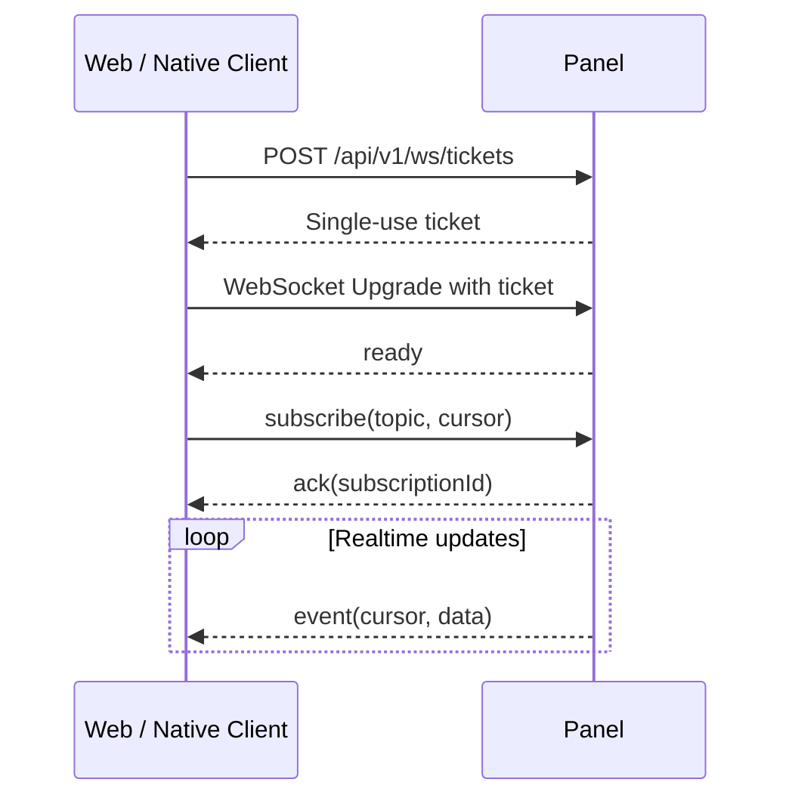

# WebSocket 实时 API v1

## 1. 连接

WebSocket 用于 Core 状态、实例状态、控制台、指标和任务进度。资源的初始快照仍通过 REST 获取，WebSocket 只传递变化和实时流。

连接流程：

1. 客户端调用 `POST /api/v1/ws/tickets`。
2. Panel 返回 30 秒内有效、仅可使用一次的 `ticket`。
3. 客户端连接 `wss://panel.example.com/api/v1/ws?ticket=<ticket>`。
4. Panel 消费 ticket，验证 Origin/设备会话，然后发送 `ready`。



不允许把 Access Token、Refresh Token 或 Session Cookie 复制到查询参数。浏览器可自然携带 Cookie，但仍必须使用 ticket 防止跨站
WebSocket 劫持。

```json
{
  "ticket": "single-use-opaque-value",
  "expiresAt": "2026-07-30T10:16:00Z"
}
```

## 2. 消息格式

所有消息为 UTF-8 JSON 对象，字段使用 `camelCase`。客户端命令携带 `messageId`，服务端通过 `ack` 或 `error` 关联。

### 服务端就绪

```json
{
  "type": "ready",
  "connectionId": "0198...",
  "heartbeatSeconds": 20,
  "maxSubscriptions": 100,
  "serverTime": "2026-07-30T10:15:31Z"
}
```

### 订阅

```json
{
  "type": "subscribe",
  "messageId": "0198...",
  "topic": "instance/0198-core/survival/console",
  "cursor": "1841",
  "options": {
    "streams": [
      "stdout",
      "stderr"
    ]
  }
}
```

```json
{
  "type": "ack",
  "messageId": "0198...",
  "subscriptionId": "0198...",
  "acceptedCursor": "1841"
}
```

### 事件

```json
{
  "type": "event",
  "subscriptionId": "0198...",
  "topic": "instance/0198-core/survival/console",
  "eventId": "0198...",
  "sequence": 1842,
  "occurredAt": "2026-07-30T10:15:32.415Z",
  "cursor": "1842",
  "data": {
    "stream": "stdout",
    "line": "[Server thread/INFO]: Done (3.201s)!"
  }
}
```

### 取消订阅

```json
{
  "type": "unsubscribe",
  "messageId": "0198...",
  "subscriptionId": "0198..."
}
```

### 错误

```json
{
  "type": "error",
  "messageId": "0198...",
  "error": {
    "code": "WS_TOPIC_FORBIDDEN",
    "message": "You cannot subscribe to this resource",
    "retryable": false
  }
}
```

命令级错误不关闭连接。认证失效、协议破坏或持续超限会先发送连接级错误，再使用对应 close code 关闭。

## 3. Topic

| Topic 模式                                    | 权限                                       | 数据                                |
|-----------------------------------------------|--------------------------------------------|-------------------------------------|
| `core/{coreId}/status`                        | `core.read`                                | 连接状态、延迟、版本和能力变化      |
| `core/{coreId}/metrics`                       | `core.read`                                | CPU、内存、磁盘和负载采样           |
| `core/{coreId}/cpu-topology`                  | `core.read`                                | CPU 性能类别、online 状态和预留变化 |
| `instance/{coreId}/{instanceId}/status`       | `instance.read`                            | 状态机、PID、玩家数和退出码         |
| `instance/{coreId}/{instanceId}/console`      | `instance.console.read`                    | stdout/stderr 日志行                |
| `instance/{coreId}/{instanceId}/metrics`      | `instance.read`                            | 实例 CPU、内存和网络采样            |
| `instance/{coreId}/{instanceId}/cpu-affinity` | `instance.settings.cpu` 或 `instance.read` | requested/applied CPU 与降级状态    |
| `instance/{coreId}/{instanceId}/config`       | `config.read`                              | 配置扫描与外部修改通知              |
| `instance/{coreId}/{instanceId}/extensions`   | `extension.read`                           | 安装、更新和兼容性变化              |
| `instance/{coreId}/{instanceId}/schedules`    | `schedule.read`                            | 触发与执行结果                      |
| `core/{coreId}/image-build/{buildId}`         | `image.read`                               | 镜像构建日志与进度                  |
| `task/{taskId}`                               | 任务可见                                   | 状态、进度和结果                    |
| `provision/{provisionId}`                     | 供应资源可见                               | 一键搭建/商业供应步骤与结果         |
| `tasks/mine`                                  | 已登录                                     | 当前用户可见任务摘要                |
| `audit`                                       | `audit.read`                               | 新审计事件，不含敏感详情            |

订阅时和发送每条事件前都检查资源权限。用户角色被修改后，服务端必须撤销不再允许的订阅。

不支持通配符 Topic。仪表盘需要批量状态时使用 `subscribeMany`：

```json
{
  "type": "subscribeMany",
  "messageId": "0198...",
  "topics": [
    {
      "topic": "core/0198-a/status"
    },
    {
      "topic": "core/0198-b/status"
    }
  ]
}
```

## 4. 快照与续传

- 客户端先用 REST 获取快照，再以快照中的 `eventCursor` 订阅。
- 可恢复 Topic 的事件保留期建议为 15 分钟或 10,000 条，以先达到者为准。
- cursor 有效时，Panel 先按顺序补发缺失事件，再转入实时流。
- cursor 已过期时返回 `WS_CURSOR_EXPIRED`；客户端重新获取 REST 快照。
- `sequence` 仅用于当前订阅检测缺口，恢复必须使用不透明 `cursor`。
- 客户端必须按 `eventId` 去重；断线边界可能产生至少一次投递。

控制台历史也可通过 REST `logs?after=<cursor>` 恢复。Core 重启导致历史不可用时，Panel 返回新基线并标记：

```json
{
  "type": "event",
  "topic": "instance/0198-core/survival/console",
  "data": {
    "kind": "GAP",
    "reason": "CORE_RESTARTED"
  }
}
```

## 5. 心跳

服务端每 `heartbeatSeconds` 发送标准 WebSocket Ping。客户端必须在两个周期内返回 Pong。

应用层也支持时钟和延迟检测：

```json
{
  "type": "ping",
  "messageId": "0198...",
  "sentAt": "2026-07-30T10:15:40Z"
}
```

```json
{
  "type": "pong",
  "messageId": "0198...",
  "receivedAt": "2026-07-30T10:15:40.012Z"
}
```

## 6. 背压

- 单连接默认最多 100 个订阅。
- 单条 JSON 消息最大 64 KiB。
- 服务端为每连接维护有限发送队列，建议 1,000 条或 4 MiB。
- 指标属于可合并事件：队列拥塞时只保留各 Topic 最新采样。
- 控制台与镜像构建日志属于有序事件：不能静默丢弃；队列不足时发送 `WS_SLOW_CONSUMER` 并关闭连接，客户端通过 cursor 恢复。
- 客户端不应在不可见页面订阅高频指标；移动端进入后台时应主动取消或断开。

## 7. Close Code

| Code | 含义               | 客户端行为                    |
|-----:|--------------------|-------------------------------|
| 1000 | 正常关闭           | 按产品需要重连                |
| 1002 | 协议错误           | 不自动重试，记录客户端缺陷    |
| 1008 | 鉴权/权限策略失败  | 刷新会话后重新获取 ticket     |
| 1009 | 消息过大           | 修正客户端请求                |
| 1011 | 服务端内部错误     | 退避重连                      |
| 4001 | 会话过期或撤销     | 刷新或重新登录                |
| 4002 | ticket 无效/已使用 | 重新获取 ticket               |
| 4003 | 客户端消费过慢     | 用最后 cursor 退避重连        |
| 4004 | Panel 正在关闭     | 使用 `retryAfterSeconds` 重连 |

## 8. 重连

客户端采用带随机抖动的指数退避：1、2、4、8、16、30 秒，上限 30 秒。网络恢复或应用回到前台可立即尝试一次。

每次重连必须：

1. 确认 Access Token/Cookie 仍有效，必要时刷新。
2. 获取新的 WebSocket ticket。
3. 建立连接并等待 `ready`。
4. 使用每个 Topic 最后已处理 cursor 恢复订阅。
5. 对 `WS_CURSOR_EXPIRED` 的 Topic 单独刷新快照，不影响其他订阅。

## 9. 安全要求

- ticket 随机强度至少 128 bit，只保存摘要，成功或失败使用后都作废。
- 校验浏览器 Origin；原生客户端在 ticket 中绑定 sessionId 和 deviceId。
- Topic 字符串解析后使用结构化资源 ID 鉴权，禁止前缀字符串判断权限。
- 控制台内容视为不可信文本，WebUI 必须以纯文本渲染，不能作为 HTML。
- 服务端错误、事件和关闭原因不得包含 Token、PSK 或未脱敏命令。
